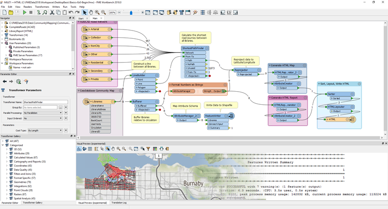

# FME Desktop #
This course is about FME Desktop. FME Desktop is for data translations and transformations at the desktop level (as opposed to FME Server, which is an enterprise-level, web-based product). 

FME Desktop consists of a number of different tools and applications. The two key applications are **FME Workbench** and the **FME Data Inspector**.

## FME Workbench ##
FME Workbench is the primary tool for defining data translations and data transformations. It has an intuitive point-and-click graphic interface to enable translations to be graphically described as a flow of data.

 Map tiles by <a href="http://stamen.com">Stamen Design</a>, under <a href="http://creativecommons.org/licenses/by/3.0">CC-BY-3.0</a>. Data by <a href="http://openstreetmap.org">OpenStreetMap</a>, under <a href="http://creativecommons.org/licenses/by-sa/3.0">CC-BY-SA</a>.

Workbench is not a standalone tool. It is fully integrated to interact with other FME Desktop applications such as the FME Data Inspector.

## FME Data Inspector ##
The FME Data Inspector is a tool for viewing data in any of the FME supported formats. It is used primarily for previewing data before translation or reviewing it after translation.

