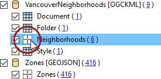
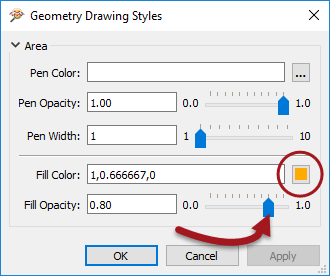



 The Display Control window shows a number of different layers in the VancouverNeighborhoods dataset. In reality most of these are tabular (non-spatial) items. The layer we are really interested in is called Neighborhoods.

Click the symbology icon for the Neighborhoods data in the Display Control window:

Set the color to be a neutral shade (like orange) and increase the opacity value to 0.8:



 The previous change makes it clear that the zone features are below the neighborhoods in the drawing order. To solve this problem drag the Zones dataset above the VancouverNeighborhoods dataset in the Display Control Window.

At the same time set a color for the zones data fill color and reduce the opacity value to 0.1. The main view will now look like this:

If you query a zone feature you'll see that it has both a ZoneCategory and ZoneName attribute. You might not realize, but there is a relationship between those attributes. Each ZoneName belongs to a specific ZoneCategory, where Category:Name is a 1:Many relationship.
